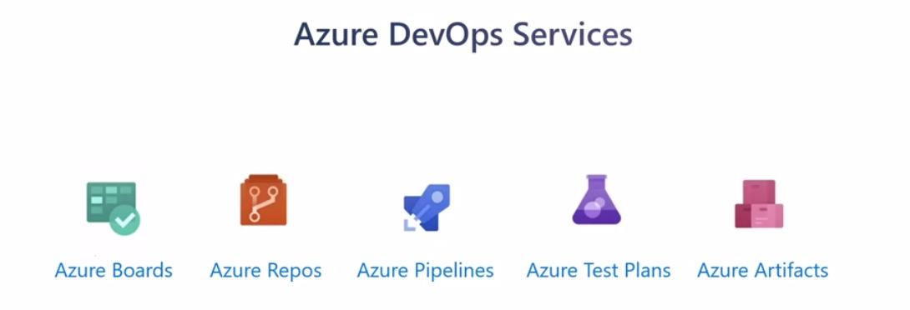

# AI Services & Solutions

In this chapter, you'll learn about AI and software development tools and services from Microsoft Azure. You'll be introduced to these tools and services and will be asked to help choose the best one for a given business scenario.

## AI Services


Artificial Intelligence (AI) is a broad classification of computing that allows a software system to perceive its environment and take action that maximizes its chance of successfully achieving its goals. A goal of AI is to create a software system that is able to adapt or learn something on its own without being explicitly programmed to do it.

There are two basic approaches to AI:

* Deep Learning: a system that's modeled on the neural network of the human mind, enabling it to discover, learn, and grow through experience. 

* Machine Learning, a data science technique that uses existing data to train a model, test it, and then apply the model to new data to forecast future behaviors, outcomes, and trends. 

### Product Options

At a high level, there are three primary product
offerings from Microsoft, each of which is designed for a specific audience and use case:
* Azure Machine Learning is a platform for making predictions. It consists of tools and services that allow you to connect to data, to train and test models, to find one that would most accurately predict a future result. Choose Azure Machine Learning when your data scientists need complete control over the design and training of an algorithm using your own data. 

* Azure Cognitive Services provide pre-built machine learning models that enable applications to see, hear, speak, understand,and even begin to reason. Use Azure Cognitive Services to solve general problems, such as analyzing text for emotional sentiment, or analyzing images to
recognize objects or faces. Azure Cognitive Services can be divided into the following categories;
  * Language services, allow your apps to process natural language with pre-built scripts, evaluate sentiment, and learn how to recognize what users want. 
  * Speech services,converts speech into text and text into natural sounding speech. 
  * Vision services, add recognition and identification capabilities when you're analyzing pictures, videos, and other visual content
  * Decision services, add personalized recommendations for each user that automatically improve each time they're used. Moderate content to monitor and remove offensive or risky content and detect abnormalities in your time series data. 
  
* Azure Bot Service and Bot Framework are platforms for creating virtual agents that understand and reply to questions just like a human. Behind the scenes, the bot you build uses other Azure services, such as Azure Cognitive Services to understand what their human counterparts are asking for. 

### Decision criteria

Use Azure Bot Service when building a virtual agent that interfaces with humans via natural language or creating FAQ pages, support websites, product manuals, SharePoint documents or editorial content

Use Azure Cognitive Services when the service you are building needs to understand the content and meaning of images, video or audio are that can translate text into a different language. If you need to predict user behavior or provide users with personalized recommendations in your app, you should use Azure Cognitive Services Personalizer.

Use Azure Machine Learning when you app needs to predict future outcomes based on private historical data because when you're working with proprietary data, you're likely need to build a more custom tailored machine learning model.

## Software development Process Tools and Services
DevOps is a set of practices and cultural philosophies that aims to improve collaboration and communication between software development teams and IT operations teams. 

The main goal of DevOps is to enable organizations to deliver software more frequently, reliably, and efficiently. It achieves this by automating and streamlining the processes involved in building, testing, deploying, and monitoring software applications. By adopting DevOps practices, organizations can achieve faster time-to-market, higher quality software, and improved customer satisfaction.

Microsoft offers a comprehensive set of tools to help organizations implement DevOps practices, develop solutions, and save money while doing so.

### Product Options
Azure introduce three primary offerings. Azure DevOps Services, GitHub and GitHub Actions, and Azure DevTest Labs.

1. Azure DevOps Services:
   - Azure Boards: This agile project management suite includes Kanban boards, reporting, and tracking ideas. It allows you to visualize work at different stages of the process.
   - Azure Repos: It is a centralized source code repository where software development, DevOps, engineering, and documentation professionals can publish their code for review and collaboration.
   - Azure Pipelines: This tool enables continuous integration and continuous delivery (CICD) pipeline automation. It helps automate the build, test, and deployment processes.
   - Azure Test Plans: It is an automated test tool that can be used in a CICD pipeline to ensure quality before a software release.
   - Azure Artifacts: This repository hosts artifacts such as compiled source code, which can be used in testing or deployment pipeline steps.

```md

```

2. GitHub and GitHub Actions:
   - GitHub: It is a popular code repository for open-source software. It provides a shared source code repository, project management tools, issue tracking, CICD pipeline automation, and collaborative documentation. You can choose between Azure DevOps and GitHub based on your organization's needs. Azure DevOps is more focused on enterprise development with robust project management tools, while GitHub is popular for open-source projects. However, you can also combine these services as needed.
   - GitHub Actions: This feature enables workflow automation with triggers for various lifecycle events. It allows you to automate tasks such as continuous integration or continuous delivery.

3. Azure DevTest Labs:
   - Azure DevTest Labs provides an automated means of managing the process of building, setting up, and tearing down virtual machines (VMs) that contain different configurations of your software projects.
   - It allows developers and testers to perform tests across a variety of environments and configurations. It can provision not only VMs but also other resources in Azure.

### Decision Criteria

The choice between Azure DevOps and GitHub depends on various factors such as automation needs, open source software development, customization requirements, project management capabilities, and integration with third-party tools. Consider these factors to make an informed decision that aligns with your business needs:

1. Automate of test-lab environment: Among the three tools and services discussed, Azure DevTest Labs is the only one that offers the functionality to automate the creation and management of a test-lab environment. This makes it a suitable choice if your goal is to automate these processes. Azure DevTest Labs allows for the provisioning of pre-created lab environments with required configurations and tools already installed. 

2. Automation with Azure Pipelines or GitHub Actions: While Azure DevTest Labs is specific to test-lab environments, you can still automate the provisioning of new labs as part of a tool chain by utilizing Azure Pipelines or GitHub Actions. This allows for seamless integration and automation within your development workflow.

3. Open Source Software: If you are building open source software, GitHub is often the preferred choice. It has gained popularity and acceptance within the open source development community due to its visibility and widespread usage. GitHub provides a platform for hosting and collaborating on open source projects.

4. Customization and Project Management: Azure DevOps excels in project management and reporting capabilities. It offers a highly customizable environment, allowing administrators to add custom fields to capture metadata and other relevant information alongside each work item. You would use Azure DevOps Services if your software development teams work on many different projects and they are required to provide project sponsors and managers with reports, progress tracking, bug reports etc. and management wants to ensure that individuals have access to only the information they need to do their work.

5. Integration with Third-Party Tools: When making a decision between Azure DevOps and GitHub, it is important to consider how tightly you need to integrate with third-party tools. Most DevOps tool vendors provide hooks or APIs that can be utilized by both Azure Pipelines and GitHub Actions. It is crucial to evaluate your organization's existing investments in tools and services to determine how these dependencies might impact your choice.

6. Mixing and Matching Services: Your options are not limited to Azure DevOps services or GitHub and GitHub Actions. In practice, you can mix and match these services as needed. For example, you can use GitHub Repos with Azure Boards for work item tracking. This flexibility allows you to tailor your toolset to meet your specific requirements.


